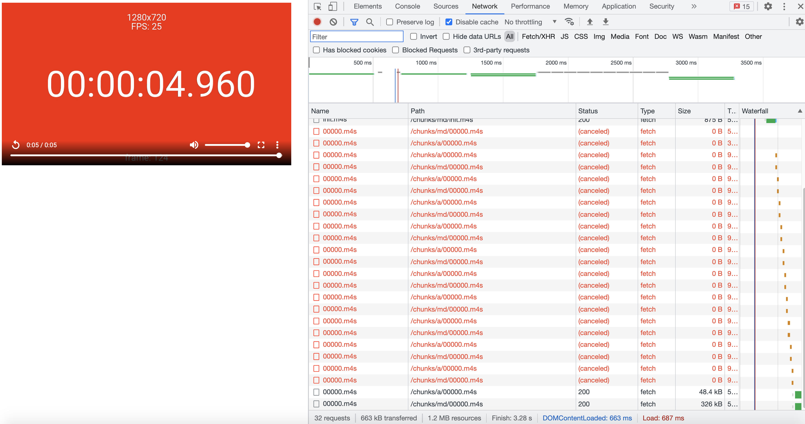

# What is this?

This repo attempts to reproduce a possible issue with Shaka 3.2.0.
# Quickstart
Requires Node v10+
```
npm install
npm run start
```
This serves the static directory with a delay of 300ms for all files. Then, open http://localhost:8000, and view the network tab, and you should see something like this:




(This is on Chrome This is on Chrome 95.0.4638.54)
# The Possible Issue
When initially loading a manifest, we pass in a time via the documented api for `player.load()` (the second argument). If we then use the video element API to request a seek without waiting for the segment to finish loading, we see a large number of cancelled and restarted requests (usually, exactly 11 requests) for the same segment within a short timeframe-- even if we only request a seek once, and even if the requested seek lies within the same segment which is already being requested.

But, this behavior seems tied to there being a network delay. The setup in this repo introduces an artificial delay (currently hardcoded to 300ms in the start script in `package.json`). We can see the issue with a delay as low as 50.

# Why this matters
In a discussion in the Shaka channel on the `video-dev` Slack [here](https://video-dev.slack.com/archives/C01QRAFHLQK/p1635184330009100) Joey suggests that it does not make sense to issue requests while segments are still being pulled down, and that the caller should throttle seek requests when not using the Shaka UI (which does so internally). We understand and agree that Shaka should not be expected to handle many rapidly-issud seek requests sent to the video element and that some degree of failure is expected, here, but we wonder if there is a way to fail more gracefully:

1. If the seek is to the chunk already being fetched, this request should not be cancelled
2. We should see at most one cancellation and re-start per stream corresponding to each seek request (the ratio seems to be 11-to-one)

Here is why this ends up mattering for our organization: we are using a proprietary technique to generate DASH segments just-in-time on a backend so that when users upload files to our systems, they can be played back and scrubbed without having to wait for a blocking DASH transmux. When there is a cache miss, it can take some time for a response to arrive. This means we sometimes need to block further seeks from being passed along to the video element for quite some time (500ms-1sec). This is a workable tradeoff, but because we don't seem to (yet) have a reliable means to verify that the video is ready for seeking, we still can hit the case where we trigger the 11 cancels and restarts with some frequency.

This is admittedly a bit unusual--we assume just-in-time dash transmuxing is rare and most segments are served from CDNs or the like--but we do beleive the delays which we see causing our issue to be potentially within the range of normal network delays such that a change here (if we're right about there being a better way to handle premature seeks) might benefit others.
